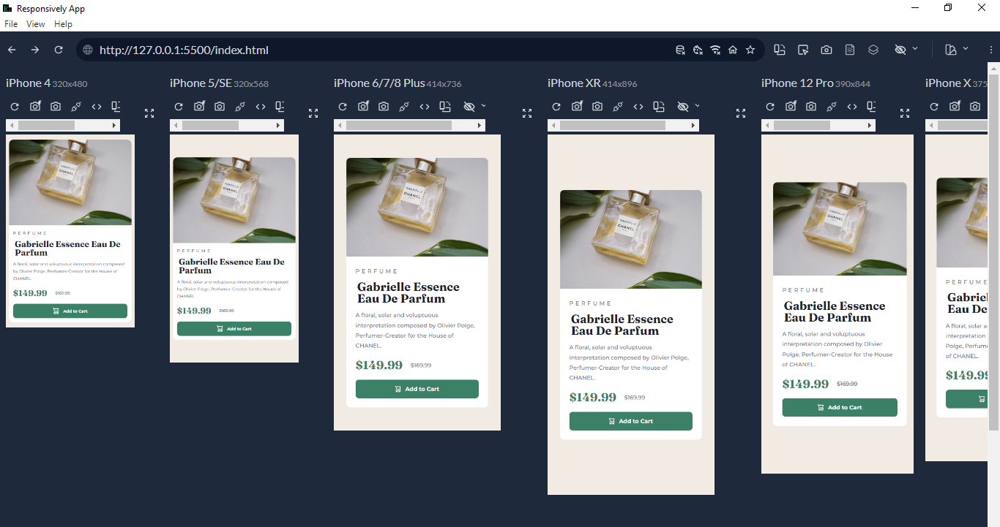

# Frontend Mentor - Product preview card component solution

This is a solution to the [Product preview card component challenge on Frontend Mentor](https://www.frontendmentor.io/challenges/product-preview-card-component-GO7UmttRfa). Frontend Mentor challenges help you improve your coding skills by building realistic projects. 

## Table of contents

- [Overview](#overview)
  - [The challenge](#the-challenge)
  - [Screenshot](#screenshot)
  - [Links](#links)
- [My process](#my-process)
  - [Built with](#built-with)
  - [What I learned](#what-i-learned)
  - [Continued development](#continued-development)
  - [Useful resources](#useful-resources)
- [Author](#author)

## Overview

This is the first challenge in the **Building Responsive Layouts Frontend Mentor Roadmap**. As the roadmap name indicates I tried to focus on making the design works across as many devices as I could.

It was a fun and challenging exercise. I tried to use viewport units and calc functions to scale font-size and padding to reduce the code nested in media queries.

### The challenge

Users should be able to:

- View the optimal layout depending on their device's screen size
- See hover and focus states for interactive elements

### Screenshot

#### Mobile

#### Desktop

### Links

- Solution URL: [Solution URL](https://www.frontendmentor.io/solutions/responsive-product-preview-card-component-Np8QvQrNyx)
- Live Site URL: [Live Site URL](https://frontendmentor-ilyesab.github.io/product-preview-card-component/)

## My process

### Built with

- Semantic HTML5 markup
- CSS custom properties
- Flexbox
- CSS Grid
- Mobile-first workflow

### What I learned

Using a combination of the `clac()` function and `vw & rem` units to scale font-size and spacing based on the user's viewport width and font preferences.

### Continued development

I'd like to learn more about the different techniques used to scale typography and spacing responsively without the use of media queries such as `clamp` function and `minmax` function for grid.

I didn't use either in this challenge as it seemed I achieved something close to the design by only using `calc` and a couple of media queries but I'm interested in those and their applications in responsive design.

### Useful resources

- [Responsively](https://responsively.app/) - This tool let you view the design across different devices at once. I configured it with a couple of devices (phones, tablets and desktops) to see if the design looks good on some of the standard devices on the market today.

#### Responsively Screenshot

## Author

- Frontend Mentor - [@ilyesab](https://www.frontendmentor.io/profile/ilyesab)
